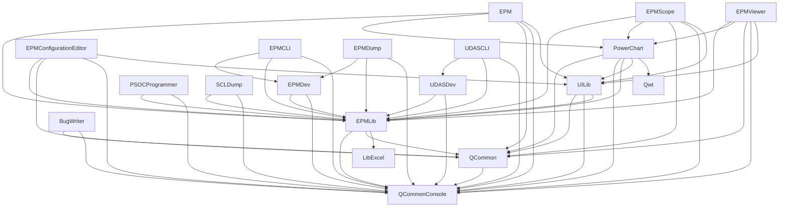

# Qualcomm Embedded Power Measurement (QEPM)

[](https://github.com/qualcomm/qcom-embedded-power-measurement/actions/workflows/build.yml)

## Table of Contents
- [Introduction](#introduction)
- [What You Get](#what-you-get)
- [Hardware Requirements](#hardware-requirements)
- [Common Prerequisites](#common-prerequisites)
- [Windows Guide](#windows-guide)
- [Linux Guide](#linux-guide)
- [Repository Structure](#repository-structure)
- [Application Dependency Architecture](#application-dependency-architecture)
- [Support & Contributing](#support--contributing)

## Introduction

QEPM is a software suite that enables users to perform power measurement on Qualcomm devices. The device to be controlled must be attached to a Qualcomm approved debug board. The device to be tested is connected to a host using a USB cable.

## What You Get

| Application | Description |
| :--- | :--- |
| **Embedded Power Measurement (EPM)** | View power measurement channels, select channels for recording, save runtime configurations for automation |
| **EPMConfigurationEditor** | Create configuration to perform power measurements on a Qualcomm platform |
| **EPMScope** | View real-time current & voltage graphs for selected power measurement channels |
| **EPMViewer** | View current & voltage graphs for power measurement channels from already acquired data |
| **Command-line utilities** | EPMDump, SCLDump, EPMCLI, UDASCLI, PSOCProgrammer |
| **BugWriter** | File bug reports with QEPM from within Qualcomm network |

## Hardware Requirements

**Required Hardware**:
- Qualcomm approved debug board (PSoC-based)
- Qualcomm device to be controlled
- USB Cables: Type B Micro-USB (Board to Host) & Type-C (Device to Host)

**Setup**: Connect the device to the debug board (directly or via cable strip) and both to the host.

## Common Prerequisites

### Development Tools

| Category | Software | Minimum Version |
| :-- | :-- | :-- |
| **OS** | Windows / Debian | Windows 10+ / Ubuntu 22.04+ |
| **Compiler** | [MSVC 2022](https://aka.ms/vs/17/release/vs_community.exe) / GCC | MSVC 2022 / GCC-11, G++-11, GLIBC-2.35 |
| **UI Framework** | [Qt Open-source](https://www.qt.io/download-qt-installer-oss) | 6.10.0+ |

> [!NOTE]
> Review license terms for [Visual Studio](https://visualstudio.microsoft.com/license-terms/) and [Qt](https://www.qt.io/development/download-open-source). 
> Qwt dependency is fetched and compiled automatically during the CMake configuration step when building from source.

### Optional Software

QEPM allows you to view streaming device logs as you transition the device between different states. The debug logs are streamed over USB serial interface(s).

To view these logs, you may install [Putty](https://www.putty.org/) or similar terminal software. QEPM does not depend on or use this software.

### Clone Repository

```bash
git clone https://github.com/qualcomm/qcom-embedded-power-measurement.git
```

## Windows Guide

### Configuration

1. **Visual Studio**: Install **Desktop development with C++** and **.NET desktop development**.
2. **Qt**: Install Qt 6.10+ for **MSVC 2022 64-bit**, **Qt Serial Port** and **Qt Multimedia** component.

> [!NOTE]
> Installation using Qt Online Installer will require users to create a Qt account.
3. **Environment Variable**:
   ```cmd
   setx QTBIN C:\Qt\<version>\msvc2022_64\bin
   ```

### Build & Usage

Execute CMake to configure and build the project:

```cmd
cmake -B build
cmake --build build --config Release
```

**Build output**:
- Debug: `__Builds\x64\Debug`
- Release: `__Builds\x64\Release`

**Usage**:
```cmd
__Builds\x64\Release\bin\EPM.exe
```

## Linux Guide

### Configuration

> [!IMPORTANT]
> - Installation using Qt Online Installer will require users to create a Qt account.
> - If you're frequently working with Qt on Linux, consider adding the environment variables to `.bashrc`.

1. **Qt Installation** (choose one):
   
   **Option A**: Qt Online Installer
   - Install Qt 6.10+ for **GCC 64-bit** and **Qt Serial Port** component using [Qt Online Installer](https://www.qt.io/download-qt-installer-oss)
   
   **Option B**: Quick Installation via apt
   ```bash
   sudo apt install qt6-base-dev qt6-serialport-dev
   ```
2. **Runtime Dependencies**:
   ```bash
   sudo apt install libusb-dev libusb-1.0-0-dev libxcb-cursor0 libpcre2-16-0 libxkbcommon-x11-0 libxcb-xkb1 libxcb-icccm4 libxcb-shape0 libxcb-keysyms1 libgl1 libegl-dev libxcb-xinerama0 libpulse-dev
   ```
3. **Environment Variable**:
   ```bash
   export QTBIN=/path/to/Qt/directory/<version>/gcc_64/bin
   ```

### Build & Usage

Execute CMake to generate executables:

```bash
cmake -B build
cmake --build build --config Release
```

**Build output**:
- Debug: `__Builds/Linux/Debug`
- Release: `__Builds/Linux/Release`

**Usage**:
```bash
./__Builds/Linux/Release/bin/EPM
```

## Repository Structure

| Directory | Content |
| :-- | :-- |
| `.github` | CI/CD build pipelines |
| `configurations` | Platform-specific configurations |
| `docs` | Documentation and guides |
| `examples` | C++ example applications |
| `interfaces` | APIs for C++, Python |
| `src` | Source files (Applications & Libraries) |
| `third-party` | External dependency scripts |

## Application Dependency Architecture

Applications and libraries in QEPM have the following dependencies:



## Support & Contributing

- **Security**: Review [SECURITY.md](./SECURITY.md) for vulnerability reporting.
- **Contributing**: Review [License](./LICENSE) and [Code of Conduct](./CODE-OF-CONDUCT.md).
