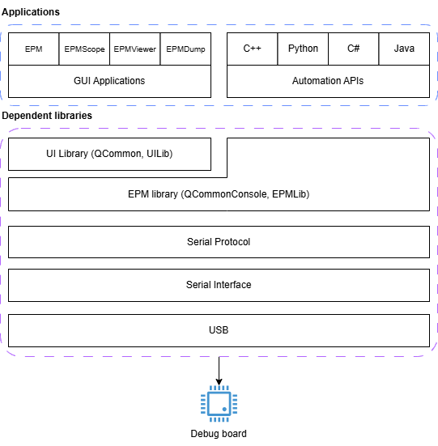
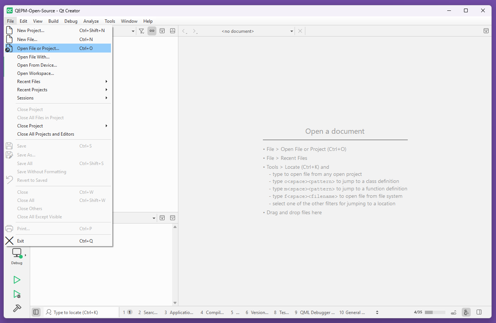
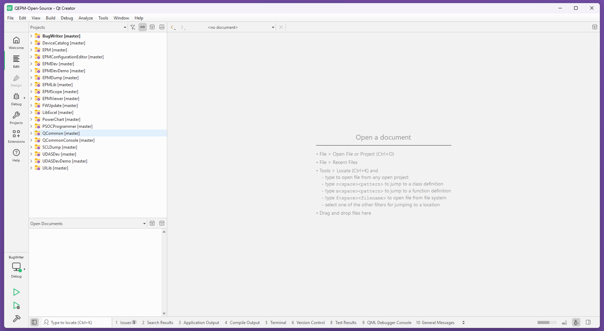

# Qualcomm Embedded Power Measurement (QEPM)

## Introduction

QEPM is a software suite that enables users to perform power measurement on Qualcomm devices.
The device to be controlled must be attached to a Qualcomm approved debug board. The device to be tested is
connected to a host using a USB cable.

### Application stack overview



## Download pre-built binaries

Download the QEPM release from the [releases](https://github.com/qualcomm/qcom-embedded-power-measurement/releases)

## Build from source

Please review the following guide to build the project from source. For one time setup instructions to build from
source, please review [software install guide](#software-install-guide)

### Clone repository

Use the below command to clone the project source:

```bash
git clone https://github.com/qualcomm/qcom-embedded-power-measurement.git
```

### Qt Creator setup

Open all project files in Qt Creator in the following manner. Project files are denoted by `*.pro`.


Once all project files are opened, the Qt Creator should look like below:


Configure project dependencies by following [Application Dependencies](#application-dependencies) section.

### Compile QEPM for Windows

Windows executables will be present at the following locations:
- Debug build will be available at `__Builds/x64/Debug`
- Release build will be available at `__Builds/x64/Release`

### Compile QEPM for Linux

Linux executables will be present at the following locations:
- Debug build will be available at `__Builds/x64/Debug`
- Release build will be available at `__Builds/x64/Release`

## Software install guide

### Install tools for development

| Category | Software | Minimum version
| :-- | :-- | :-- |
| Operating System | Windows, Debian | Windows 10 & above<br>Ubuntu 22.04 & above |
| Software development | [Visual Studio Compiler 2022](https://visualstudio.microsoft.com/downloads/#build-tools-for-visual-studio-2022) (Windows)<br>GCC (Linux) |  MSVC 2022 (Windows)<br>GCC-11, G++-11, GLIBC-2.35 (Linux) |
| Software development | [Qt Open-source](https://www.qt.io/download-qt-installer-oss) | 6.10.0 and above |
| QWT | [QWT install steps](https://qwt.sourceforge.io/qwtinstall.html) | Keep install location as per documentation |
| libusb | [libusb docs](https://libusb.info/) | Required on Linux. Unzip at /usr/local/libusb-1.0.27 |

Please review the usage policies, license terms, and conditions of the above software before use.

### Configure Qt installation

QEPM requires Qt6 and MSVC2022 64-bit. Please review below custom install configuration in Qt
to optimize download time.

Required additional libraries:

1. Qt Serial Port
2. Qt Remote Objects

## Application dependencies

Applications and library in QEPM has the following dependencies.
Please configure dependencies from Qt Creator > Project > Dependencies for each project:

| Project | Dependencies |
| :-- | :-- |
| BugWriter | QCommon, QCommonConsole, UILib |
| DeviceCatalog | QCommon, QCommonConsole, UILib |
| EPM | EPMLib, QCommon, QCommonConsole, UILib |
| EPMConfigurationEditor | QCommon, QCommonConsole, UILib |
| EPMDev | EPMLib, QCommonConsole |
| EPMDevDemo | EPMDev, EPMLib |
| EPMDump | EPMDev, EPMLib, QCommonConsole |
| EPMLib | QCommonConsole |
| EPMScope | EPMLib, PowerChart, QCommon, QCommonConsole, UILib |
| EPMViewer | EPMLib, PowerChart, QCommon, QCommonConsole, UILib |
| PowerChart | QCommon, UILib |
| QCommon | QCommonConsole |
| SCLDump | EPMLib, QCommonConsole |
| UDASDev | EPMLib, QCommonConsole |
| UDASDevDemo | UDASDev |
| UILib | QCommon, QCommonConsole |

**Brief description on the tools generated by QEPM**:
1. Embedded Power Measurement (EPM): View list of power measurement channels, include, exclude channels from recording, save runtime configurations for automation
2. EPMConfigurationEditor: Create new EPM configuration to perform power measurements on a Qualcomm platform
3. EPMScope: View realtime current and voltage channel graphs for selected power measurement channels
4. EPMViewer: View current and voltage channel graphs for power measurement channels after from already acquired data
5. EPMDump: Command-Line Utility to view list of connected devices capable of performing power measurements on Qualcomm platform
6. SCLDump: Command-Line Utility to view summary of acquired power data, provide the .scl file path as argument from the acquired data directory
7. BugWriter: File bug reports with Alpaca from within a Qualcomm network
8. EPMDevDemo: Example application to demonstrate how EPM C++ APIs can be used to write custom data-capture command-line application
9. UDASDevDemo: Example application to demonstrate how EPM C++ APIs can be used to write custom post-processing command-line application

## Qualcomm device control using QEPM

### Hardware setup

QEPM requires you to have physical access to Qualcomm approved devices and debug boards. QEPM is device-agnostic
and supports all Qualcomm chipsets and form-factors.

The Qualcomm device may be attached directly to the debug board or through cable strip depending on the
form-factor or the guidelines outlined in the hardware manual.

If you've questions, suggestions or issues with setup, please do reach out to us on
[discord](https://discord.com/invite/qualcommdevelopernetwork).

You will have to install the [required drivers](#install-drivers) correctly. The one-time driver installation
step is taken care if you install a release package.

### Install drivers

The one-time driver installation step is taken care if you install a release package. If you choose
to [build from source](#build-from-source), configure below drivers:

1. [Qualcomm USB Drivers](https://softwarecenter.qualcomm.com/catalog/item/QUD): to view device
   status (Emergency Download Mode, USB Diagonistics Mode, etc)

### Optional software

QEPM allows you to view the streaming device logs as you transition the device between different
states. The debug logs are streamed over USB serial interface(s).

To view these logs, you may install [Putty](https://www.putty.org/) or a similar software. QEPM
does not depend or use this software.

## Bug & Vulnerability reporting

Please review the [SECURITY.md](./.github/SECURITY.md) before reporting vulnerabilities with the project

## Contributor's License Agreement

Please review the Qualcomm product [license](./LICENSE), [code of conduct](./CODE-OF-CONDUCT.md) & terms
and conditions before contributing.
