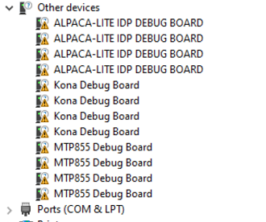

# Bootcamp Reference

This guide will help you quickly get started with development using the QEPM
Python libraries provided as part of the QEPM installation.

## Prerequisites

You must have **Python 3** installed with version **3.8.0** or later.

## Installing the libraries

After you have installed QEPM from QPM, navigate to the path below based on
your OS:

- Linux: `/opt/qcom/QEPM/python/`
- Windows: `C:\ProgramData\Qualcomm\QEPM\Python\XPlatform`

Execute `setup.sh` on Linux or `setup.bat` on Windows.

> Sample example scripts are available at: `C:\QEPM\Examples`

> **Note:** Use only the API provided under the `XPlatform` sub-directory.

## Testing the setup

Add the statements below to a Python file and execute the script:

```python
# Import the QEPM EPMDev library
import EPMDev

# Get the count of TAC devices
device_count = EPMDev.GetDeviceCount()

# If the device count is 0, print a message and exit
if device_count == 0:
    print("Found 0 EPM device")
    exit(0)

# Print the serial number and port name for every TAC device
for idx in range(device_count):
    tac_device = EPMDev.GetDevice(idx)
    print(f"Found device with serial number: {tac_device.SerialNumber()} and port name: {tac_device.PortName()}")
```

If the script executes without errors, the libraries are installed correctly.

## Troubleshooting

**Q. Why do I receive `ModuleNotFoundError` when importing EPMDev or EPMDev?**

A. Follow the [Installing the libraries](#installing-the-libraries) section
to install the Python packages.

**Q. I received the error below while importing the libraries. Why?**

_Could not find module 'C:\Program Files (x86)\Qualcomm\QEPM\EPMDev.dll'
(or one of its dependencies). Try using the full path with constructor syntax._

A. You may be importing the library after uninstalling QEPM.
Reinstall QEPM from QPM and try again.

**Q. Why does `EPMDev.GetDeviceCount()` return 0 devices?**

A. Verify that the debug board is properly connected to your setup.

If the connection looks correct, check for an **Unknown Device** in
**Device Manager** on Windows.

**Q. `EPMDev.GetDeviceCount()` does not return the expected device count. Why?**

A. Check whether you have exhausted the available serial port connections in
**Device Manager** on Windows. Sample scenario shown in the image below.


