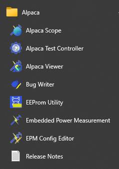
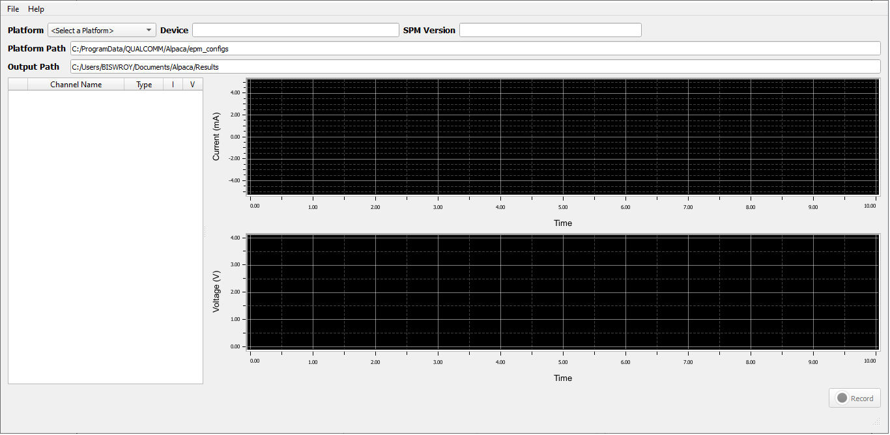
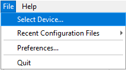
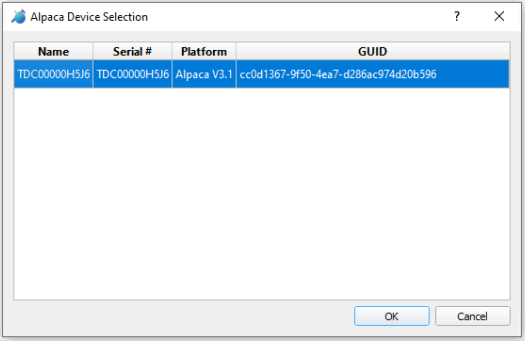
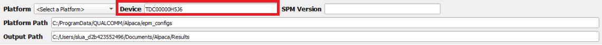
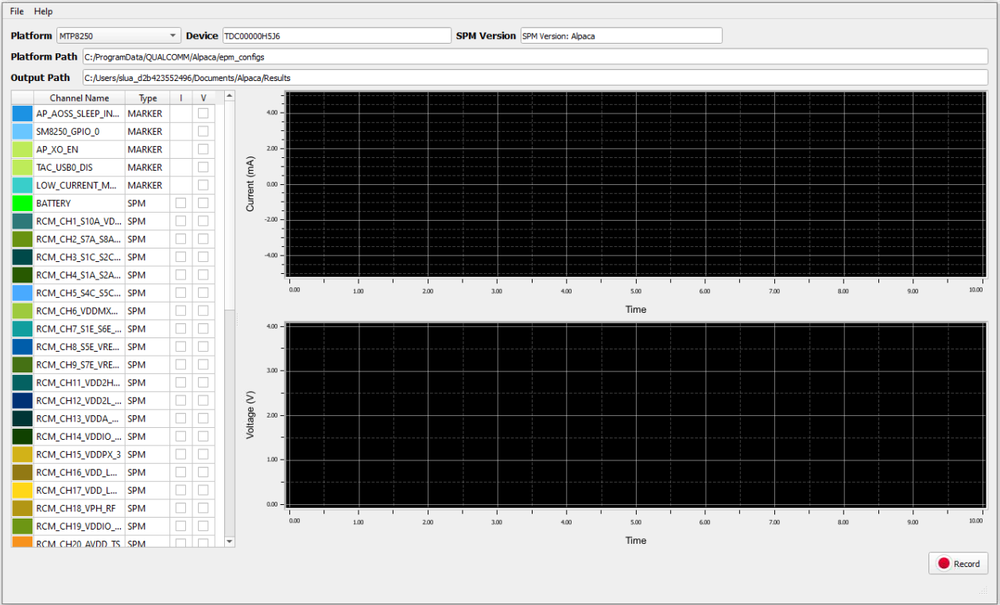
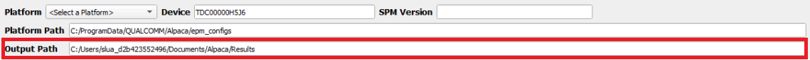
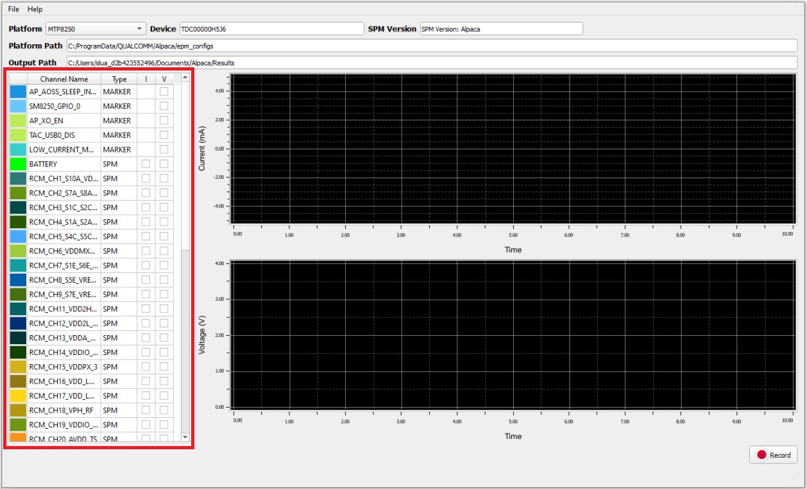
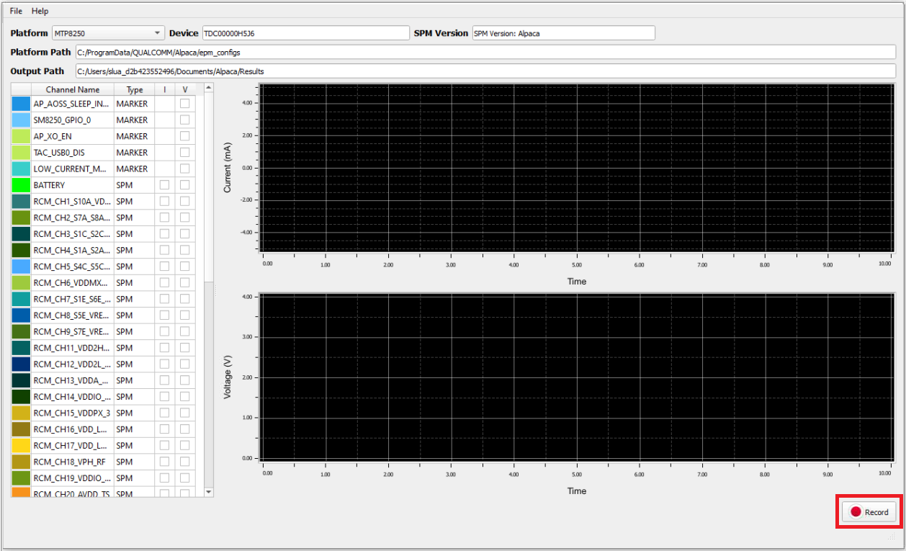

# EPM Scope

## Introduction

EPM Scope is part of the QEPM Application Suite. EPM Scope provides dynamic visualization from EPM data acquisition. Begin by selecting your platform and device, then select the channels and their attributes to visualize, and press record to save the data.

This guide will help you quickly get started with the EPM Scope. To open EPM Scope, go to the start menu on Windows and find EPM Scope from the EPM sub-menu as shown below.

You should see the following window.

## Select the device for data acquisition

To start acquiring data from the EPM device, make sure that the EPM device is connected to the host machine. Then, click 'Select Device...' from the File menu below.

The device selection dialogue box appears as shown below. Choose your EPM device from the list.

Click **OK** to confirm the device selection for data acquisition. The device name will appear in the window as highlighted below.

## Choose the appropriate platform

EPM Scope uses EPM configurations to measure rail currents and voltages on any EPM-enabled device. Before capturing data, you need to choose the appropriate platform for the connected EPM device.

If you do not find your configuration in the Platform dropdown, please report issues under [GitHub issues](https://github.com/qualcomm/qcom-embedded-power-measurement/issues).

Once you choose the appropriate platform from the platform drop-down, the SPM Version will be populated.

## Set the save location for the acquired data

The recorded EPM data is saved at C:/Users/<username>/Documents/EPM/Results by default. In case, you need to modify the save location, you can update the save path to the desired location on the machine.

## Select the channel attributes to visualize

Before starting to capture data, you will need to select the channel attributes for which the data needs to be captured. It is important to select only the channel attributes of interest as selecting more channel attributes can quickly bloat the output file size. The I column represents the current and the V column represents the voltage for a given channel attribute.

## Start recording

To start recording the EPM data for the selected channel attributes, click on the record button. To stop recording the channel data click on Stop. It is recommended to capture data for a small time only to keep the output file size minimum. 

