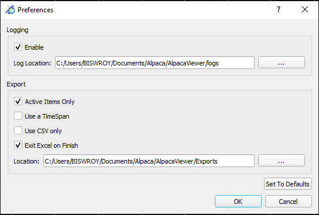

# EPM Viewer

## Introduction

EPM Viewer is part of the QEPM Application Suite. It provides visualization
of EPM acquisition results. Begin by opening an EPM results file. The captured
channels are listed under the **Current and Voltage** and **Power** tabs.
Toggle the channel attributes you wish to visualize.

You can additionally change the properties of the graph by changing the limits of the area that
is plotted by editing the values of T0 and T1 in the "Cursor" section.

The statistics of the various attributes of the channels can be found in the "Statistics" 
section in the bottom right.

## The preferences window

The preferences window for EPM viewer lets you customize logging and export preferences.

## Troubleshooting

**Q. The legends for the graphs are black. I cannot see the graphs properly.**

A. Please re-record the sample and try viewing again on the same version of EPM used for
recording the data.

**Q. Nothing is exported when I try to export power, voltage or current data. Why?**

A. EPM Viewer defaults to excel format for exports. If you do not have excel installed on the
machine, you may export to `csv` format by setting the export to `csv` in the preferences window.
