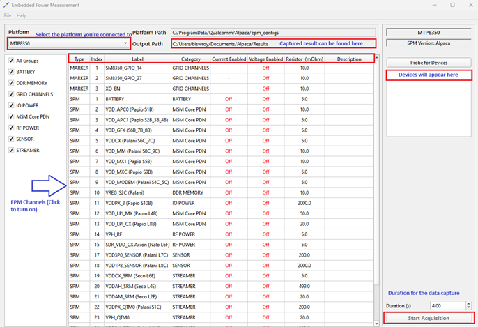

# Embedded Power Measurement

EPM is part of the QEPM Application Suite. EPM utilizes PSoC debug boards to perform power measurements on Qualcomm devices.
The following applications are included in the QEPM installation:
- Embedded Power Measurement (EPM)
- EPM Viewer
- EPM Scope
- EPM Configuration Editor

To get started with power measurement using EPM, you will need a debug board with a PSoC chip, such as `SPM v4`. If you are unsure about your debug board's power measurement capability, please reach out to the target platform team or raise an issue on [GitHub](https://github.com/qualcomm/qcom-embedded-power-measurement/issues).

## Get started with power measurements

Search for the **Embedded Power Measurement (EPM)** program from the Windows search. On Linux, the `EPM` binary is available at `/opt/qcom/EPM/bin`. Once the application window is open, it should look like below.

## Configure the platform for power measurement

The EPM Window has the `Platform` dropdown. Select the platform you wish to perform EPM measurements. The EPM channel table will now show relevant channels.

If the platform you are looking for does not exist in the dropdown, please raise an issue on [GitHub](https://github.com/qualcomm/qcom-embedded-power-measurement/issues).

## Select the channels for power measurement

The EPM channels for platforms are generally turned **OFF** by default. However, if a few channels are turned **ON**, you can manually turn them off by clicking
on the ON/OFF cell. If you want to capture all channels, you may toggle all channels by right-clicking the row and choosing **All On / All Off**.

## Choose the EPM device

The EPM device pane displays the list of devices with EPM capability. Select the EPM device that is connected to the desired platform.

If a connected debug board is not listed, check whether the device is in use by another program. If no other program is using it, verify that the debug board supports EPM capability. If you are unsure, please raise an issue on [GitHub](https://github.com/qualcomm/qcom-embedded-power-measurement/issues).

## Set the duration of power measurement

The default duration for power measurement is set to `4 seconds`. You can modify the duration of capture by updating the duration input.

## Start acquiring power data

Click **Start Acquisition** to begin measuring the selected EPM channels.

## What can EPM be used for?

EPM is used for measuring current and voltage on a select number of power rails on a target device.
Typical target devices include the MTP and QRD platforms.

Examples of EPM use-cases include:

- Sanity testing of system power states such as suspend/resume
- Verifying the system rail currents and voltages are within an expected range
- Measuring the current of various subsystems such as Audio, Display, Touchscreen, Sensors, or RF

The specific rails that can be measured and the meaning of each measurement channel varies on each target
and platform.

## Troubleshooting

A common problem is the EPM device not appearing in the list. Run the `EPMDump` utility from the command line — it lists all EPM-visible devices. If your device shows a GUID of 0, the device has not been provisioned at the factory.

Ask your device supplier to have the firmware programmed on the debug board. If the issue persists, raise a ticket on [GitHub Issues](https://github.com/qualcomm/qcom-embedded-power-measurement/issues).
