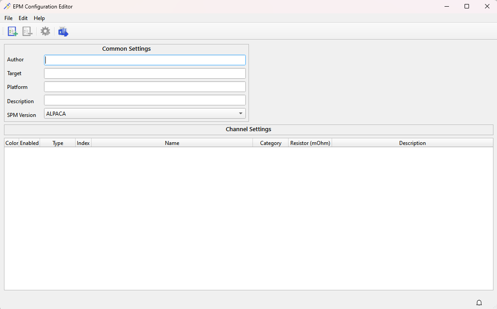
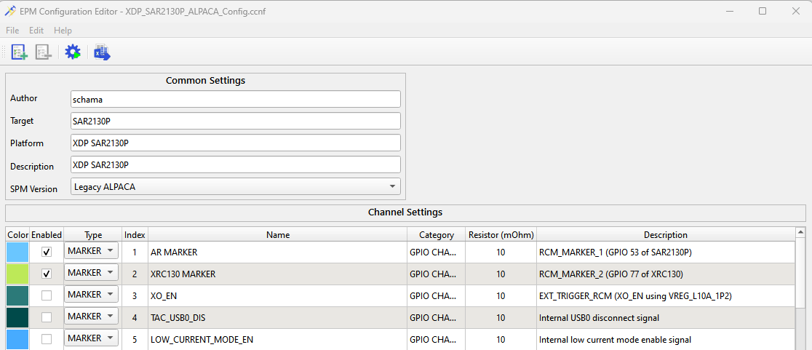

# EPM Configuration Editor

EPM Configuration Editor is part of the QEPM Application Suite. It helps hardware teams prepare the rail configuration for Qualcomm devices to enable power measurements on the platform.
The configuration contains GPIO mappings for various EPM channels, which vary between platforms and platform capabilities.
If you are working on a platform not yet supported by QEPM, please raise an issue on [GitHub](https://github.com/qualcomm/qcom-embedded-power-measurement/issues).

## Who defines EPM configurations

EPM Configurations are platform specific. Typically, Qualcomm platform teams define the configuration.

When you define a configuration, you identify yourself as the author for the configuration available for internal and external use. Our team will
work with you during development and follow up in case we need updates to the EPM configuration you've authored.

## EPM configuration metadata

When you define the EPM configuration for a platform, we identify you as the author and the point of contact for further
support on that configuration.

Please see intended information for the EPM Configuration fields:

1. **Author**: Use the author field to share your name and contact email in the format: `Firstname Lastname <email@example.com>`
2. **Target**: Comma-separated list of targets for the configuration
3. **Platform**: The name of platform you're building the configuration for. Do not include internal names / references
4. **Description**: Brief description on the reason for developing the configuration
5. **SPM Version**: The type of debug board you are building the configuration for

## EPM configuration channel table

To populate the EPM channel table, click on the **Add channel** (first button on the toolbar). To delete a channel, select the channel to delete
and click the **Delete channel** (second button on the toolbar).

## Other toolbar options

When you're working on a configuration, the `Compile to configurations` button is activated. Use this button if you wish to generate a legacy EPM
configuration (.conf) for legacy automation use-cases. This is generally not required.

The last button on the toolbar (`Import Excel template`) imports a legacy Excel template and generates an EPM configuration from it. This
is a legacy option and not frequently used.

## Save the configuration

When you have completed working on the EPM configuration, save your work by navigating to the File menu and click `Save As...`. If you are saving
updates to an existing configuration, click `Save`.

## Open existing configuration

All EPM configurations are located in the [configurations](../../configurations/) directory.
To open an existing configuration, navigate to the File menu and select `Open`. In the open dialog box, navigate to the EPM directory and open the
desired configuration to modify it.

When you save an existing configuration, the configuration at the original location will be updated. To save a new copy of the old configuration,
choose the `Save As` option.

Once saved, copy the configuration file into the [configurations](../../configurations/) directory to make it
available within QEPM applications.

## Publish EPM configurations

If you have defined EPM configurations that need to be shipped Qualcomm-wide or externally, please submit a pull request to [qcom-embedded-power-measurement](https://github.com/qualcomm/qcom-embedded-power-measurement). Add the configurations only inside the
[configurations](../../configurations/) directory.

EPM does not recommend sharing EPM configurations outside of the installation through documentation, file share and other methods.
If the configuration you are using cannot be traced to the original installation, QEPM will no longer provide support for it.
