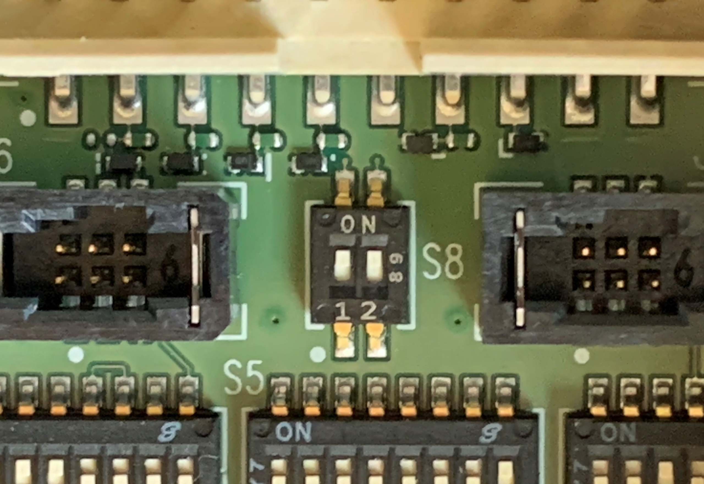

# Troubleshooting

## Introduction

The TAC application and debug board communicate one way: the board turns pin signals on and off, and the
application logs whether those commands were acknowledged. If the log shows the debug board responding
with "ok" to commands, the debug board is functioning correctly from a communication standpoint. To capture
this log, enable logging from the TAC "Preferences" panel; the log is written once you open a device, perform
operations, and then close the device.

Because signaling is one-directional, the debug board has no way of knowing whether a device is actually
connected and responding to the signals it sends. A board will toggle its pins regardless of whether a
device is present. If the log confirms the debug board acknowledged a command but the device still doesn't
behave as expected, the issue is most likely with the device or its hardware, not with the debug board or TAC.

Some power-cycling features (for example, booting) depend on precise timing that varies across hardware
revisions. If you are seeing boot issues, check with the hardware team responsible for your device about the
expected timing for button press and pause during the boot cycle.

Many issues reported are related to power on/off behavior, or the USB0/USB1 switches. If a device derives
power from a source other than the debug board, the debug board cannot cycle its power. Some devices derive
power from connected USB devices; USB1 typically signals VBus, and if the hardware or firmware doesn't wire
that signal correctly, USB1 power cycling will not work as expected. This behavior can also change after a
firmware upgrade.

If the general troubleshooting steps below don't resolve your issue, contact the hardware team responsible
for your device, or open a GitHub issue at https://github.com/qualcomm/qcom-embedded-power-measurement/issues.

## General

Turn on logging in the Preferences dialog. This produces a log of the communication transactions between the
software and the debug board. If you open a GitHub issue from the About menu, the log is included as an attachment.

1. Try another USB cable — cables are known to fail.
2. Try another debug board on the same device. If the new debug board works, the original debug board was bad.
3. Try another device with your original debug board. If the new device works, the problem is with your original device. Try updating its software.
4. Try another device with another debug board. If the new combination works, the problem is with the original combination.
5. If none of the above resolves the issue, enable logging.
6. Run your simplified test again and file a bug report from the About menu. The log is included with the report.

## Endpoint Exhaustion

Windows has a hard limit of 96 USB endpoints. When enough devices are connected, physical or virtual, Windows
is unable to add further USB devices. This is a limitation of the Windows OS itself, and QEPM cannot work
around it. You can read more about it [here](https://kb.plugable.com/questions/756044).

**USB0/USB1 disconnect not functioning**

If USB0 and USB1 disconnect are not functioning, try the following before filing an issue:

- Replace your USB cables.
- Try another device and debug board combination — if that works, the issue is not with QEPM TAC.
- Try the known-working debug board on the affected device. If it doesn't work, the issue is with the device; if it does, the issue is with the original debug board.
- Try flashing the device with the latest available software — device software malfunctions have caused this behavior in the past.

On the debug board, make sure switches 1 and 2 are in the "on" position on S8.

